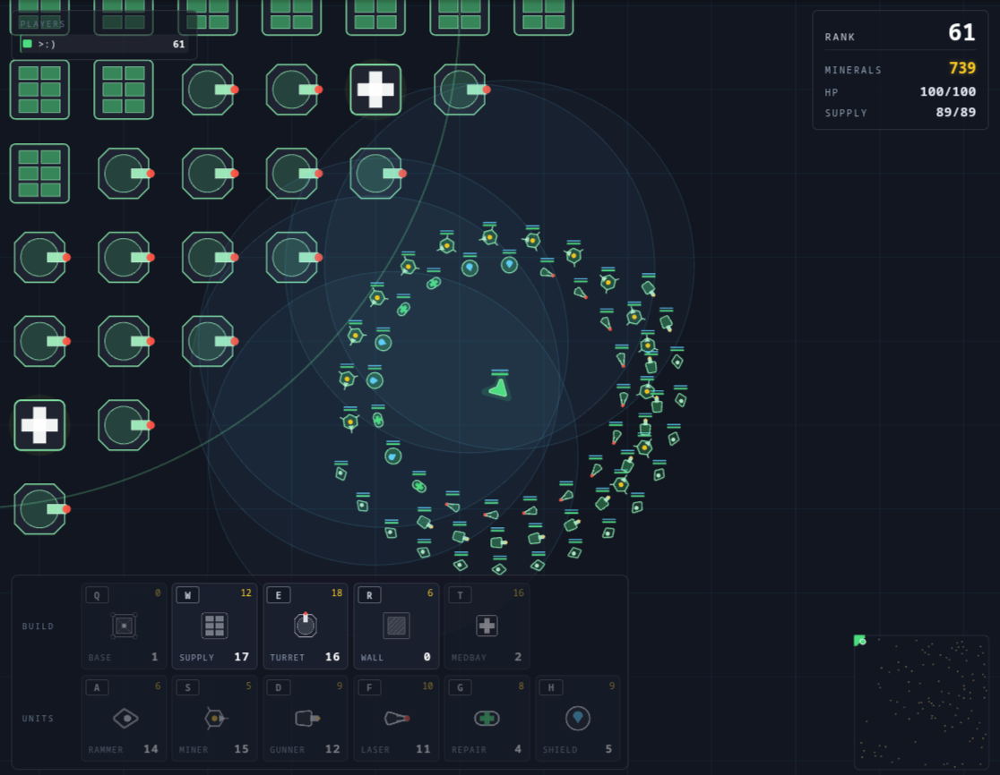

# openspace

Live demo: <https://space.lastra.us>

Multiplayer top-down arena. Drop a base, mine asteroids, wall yourself
in, build turrets, command a fleet of AI escort drones, and brawl other
players. Server-authoritative physics via Rapier2D, geometric Pixi.js
rendering, Colyseus state sync, Svelte 5 HUD.



## Quick start

```bash
pnpm install
pnpm dev
```

Open <http://localhost:5173> in two browser tabs, pick a name, fly with
the cursor.

## Controls

| Key | Action |
| --- | --- |
| Mouse | Steer toward cursor |
| **Left-click** | Designate focus target — owned attack units pursue and fire on the picked enemy / miners pursue the picked asteroid. Click empty space to clear. |
| **Space** (hold) | Recall fleet + sustained dash — burns your own units while held |
| **A / S / D / F / G / H** | Spawn rammer / miner / gunner / laser / repair / shielder |
| **Q / W / E / R / T** | Toggle base / supply / turret / wall / medbay placement (click to place) |
| **X** | Recycle mode — click an owned structure for partial credit refund |
| **Esc** or **Right-click tap** | Cancel placement / recycle mode |
| **Right-click hold + drag** | Open radial emote menu, drag to a wedge to send |
| **F1** | Debug overlay (hitboxes, target lines, prediction divergence) |

You start with a free base (Q) and a small credit pile. Drop the base to
unlock unit production — units spawn at your base and respawn there on
death. Mine asteroids with miners (per-tick drip while attached), spend
credits on units and structures, and your base projects a 600u
**territorial claim** that blocks enemies from building near you. Walls
are one-way: your own units, ship, and projectiles pass through your
walls; enemies are stopped. The world center has a no-build spawn
bubble and fresh ships get **20s of spawn invulnerability**. Lose your
ship and you drop a gold wreckage square holding your credits +
orphaned units — first player to touch it claims everything (expires
after 30s).

## Commands

| Command | Effect |
| --- | --- |
| `pnpm dev` | Server (2567) + client (5173) with hot reload |
| `pnpm typecheck` | Strict TS across all packages (incl. svelte-check) |
| `pnpm lint` | ESLint over the repo |
| `pnpm test` | Vitest for shared pure helpers |
| `pnpm build` | Production builds (shared → server → client) |

## Architecture

```
packages/shared/      cross-process source of truth
  schema.ts           Colyseus Schema (ArenaState, Player, Unit, Structure, Wreckage, Projectile, Asteroid)
  constants.ts        world dims, tick rate, gameplay tunables
  kinds.ts            UNIT_KIND_META — rammer / miner / gunner / laser / repair / shielder
  structures.ts       STRUCTURE_KIND_META — base / supply / turret / wall / medbay + recycle math
  combat.ts           Combatant union; type guards; targeting helpers
  formation.ts        multi-ring orbit slot math (server + client agree)
  movement.ts         stepPlayer (used by client prediction; server uses Rapier)
  types.ts            wire message types (inputs, build/recycle, GameEvent, EmoteMessage)

packages/server/
  rooms/ArenaRoom.ts  Colyseus room; message handlers; SimContext; per-player owner-bit allocator
  physics.ts          Rapier wrapper (bodies, colliders, contact draining, owner-bit collision groups)
  simulation.ts       per-tick orchestrator: input → AI → step → collisions →
                      mining → abilities → repairs → shields → projectiles →
                      dash burn → explosions → wreckage claim → cull/respawn,
                      with a transient event channel (kills, base-attack alerts)
  behaviors.ts        per-kind targeting + desired-velocity registry
  spatial.ts          uniform-grid neighbor index for O(1) acquire / aura queries

packages/client/
  main.ts             bootstrap: renderer, net, HUD, join overlay
  game.ts             frame loop, input, placement, FX wiring, event handler
  net/client.ts       Colyseus wrapper exposing typed snapshots + emote send + onEvent
  prediction.ts       client-side prediction for the local ship
  interpolation.ts    snapshot interpolation for remote entities
  entities/           LocalPlayer, RemotePlayer, Unit, Structure, Asteroid, Projectile, Wreckage
  render/             Pixi views (ships, units, structures, minimap, background,
                      wreckages, mining particles, heal tethers, build icons)
  effects/            death burst, respawn pulse, explosions, beams, bullet pops, emote bubbles
  hud/                Svelte 5 components — Hud (root), StatsPanel, PlayerList, BuildHud,
                      JoinOverlay, RespawnOverlay, EventFeed (top-center toasts),
                      RadialEmoteMenu (right-drag wheel), DebugPanel, Status
  debug/overlay.ts    F1 toggleable
```

### Authority + physics

- **Server runs Rapier.** Players, units, structures, asteroids are all
  rigid bodies. Most use ball colliders; walls use cuboid colliders so
  adjacent placements form a continuous barrier with no diagonal gaps.
  Each tick: write desired velocities, step, drain contact events for
  damage, read positions back into the schema.
- **Owner-bit collision groups.** Each player gets one of 15 bits at
  join (freed at leave). Walls filter that bit out of their collision
  mask, so the wall's owner — units, ship, projectiles — pass through
  freely while enemies still bounce off. This sidesteps pathfinding
  entirely: units inside a wall ring flow out to engage; respawn at base
  isn't trapped by your own walls. Bit transfer is wired into wreckage
  claim too — claimed units re-collide against their new owner's walls.
- **Client predicts the local ship** kinematically (no Rapier in the
  browser bundle) using `stepPlayer` from shared. Reconcile snaps to
  authority when drift exceeds threshold. The predictor's obstacle
  list excludes the local player's own walls so prediction agrees with
  the server's owner-bit filter.
- **Remote ships and units interpolate** server snapshots ~150ms behind
  server time. Bullets *extrapolate* from the latest snapshot anchor so
  hits land where the server saw them, with no interpolation lag.
- **Density-based mass**: ship density 12 vs unit density 1 — heavy
  ships glide through unit clusters without jitter.
- **Area-of-interest** filtering via Colyseus StateView: each client
  only sees entities within ~1500u of its ship (with hysteresis to kill
  edge-flicker).

### Combat + economy

- Every Combatant has hp/maxHp and (optionally) shield/maxShield.
  Damage drains shield first.
- Collision damage scales with relative velocity (engine-wash from a
  dashing ship melts your own fleet too).
- Units acquire nearest enemy in `aggroRadius` (sticky to
  `releaseRadius`, with neutral-target rejection so dead-player wreckage
  units don't keep half the map locked on them). Behaviors: ram,
  kite-and-shoot (hitscan laser, ballistic gunner), repair beam, shield
  aura, mine.
- **Manual focus targeting** layered on top: left-click an enemy or
  asteroid to set `Player.focusTargetId`. Owned attack units (rammer,
  gunner, laser) pursue that target across the map regardless of
  aggro/release radii; miners pursue a focused asteroid the same way.
  A pulsing crosshair tinted to the player's color marks the chosen
  target. Server clears focus on death and per-tick when the target
  no longer resolves.
- Per-player **supply cap** from depots. Excess units flip to a
  deactivated state and inertly orbit until cap returns.
- **Base** (Q, free, max 1) gates all unit production and projects a
  600u territorial claim that blocks enemy structure placement.
  **Walls** (R) are tough one-way barriers, **turrets** (E) are 96-DPS
  hitscan defenders, **medbays** (T) heal everything friendly in a
  320u aura including walls, **supply depots** (W) raise your unit cap.
  All structures snap to the 100u grid and can be **recycled** (X) for
  up to 75% of their cost, scaled linearly by remaining HP.
- **Spawn safety**: a no-build bubble around world-center prevents
  walling in the spawn zone, and fresh / respawned ships get 20 seconds
  of damage immunity (visualized as a pulsing alpha on the ship).
- **Wreckage**: dying drops a gold square sized by your credit pile,
  holding your credits and orphaned units. Touch to claim. Expires
  after 30s. Click-to-respawn — death leaves you gone until you press
  the button.

### Events, emotes, alerts

A transient event channel rides alongside the schema (Colyseus messages,
not synced state) for one-shot signals:

- **Kill toasts** stack top-center for everyone in earshot — name vs
  name, dimmed for environmental kills.
- **Emotes** — right-click hold opens a 9-wedge radial menu (greet,
  help, attack, truce, thanks, love, laugh, cry, rip). Drag-release
  fires; tap-without-drag cancels. Server rate-limits to 1/sec/player,
  enum-validates, and broadcasts an `EmoteEvent` that renders both as
  a top-center toast AND a world-space bubble that pops above the
  sender's ship and floats up over ~2s.
- **Base-under-attack** alerts fire privately to the base owner only,
  cooldowned at 30s/base so a sustained attack only pings once.

## Adding a unit kind

The simulation tick, network layer, and HUD don't change.

1. **`packages/shared/src/kinds.ts`** — register stats in `UNIT_KIND_META`.
2. **`packages/server/src/behaviors.ts`** — register a behavior in `kindBehaviors`.
3. **`packages/client/src/render/units.ts`** — add a `case` in `createUnitView`.
4. Bind a key in `game.ts` (`net.spawnUnit("yourkind")`).

`pnpm test && pnpm typecheck && pnpm lint` should stay green.

## Adding a structure kind

Mirrors the unit pattern. Check `STRUCTURE_KIND_META` (base, supply,
turret, wall, medbay) for the available fields — `colliderShape`,
`maxPerPlayer`, `healHps`/`healRange`, `abilityRange`/`abilityDamage`/
`abilityCooldownSeconds` are all optional toggles, so most structures
are a few lines of config plus a render `case` in
`packages/client/src/render/structures.ts`. Wire a placement key in
`game.ts` (the existing pattern is one `input.onKeyTap` per kind that
flips the `placing` mode).

## Known landmines

- **Schema decorator emit**: TS class-field initializers shadow
  `defineTypes` getters. Use constructor-init pattern with
  `useDefineForClassFields: false`.
- **DPR drift**: camera math uses `app.canvas.getBoundingClientRect()`,
  not `renderer.width / resolution` (Firefox disagrees).
- **Server time monotonic**: `state.serverTime = performance.now()`.
- **Rapier init is async** — cached at process scope, shared across
  rooms.
- **Body cleanup is mandatory**: `removeRigidBody` on every destroy,
  `world.free()` on room dispose. WASM heap leaks otherwise.
- **Owner-bit count is hard-capped** at `MAX_PLAYERS_PER_ROOM = 15`.
  The collision-group mask is derived from this; raising the cap past
  16 requires switching the bit packing strategy (Rapier groups are
  16+16 bits).
- **Local predictor and owner walls**: `worldObstacles` in `game.ts`
  takes the local sessionId so it can skip the local player's own
  cuboid walls — without that, prediction collides with walls the
  server lets you pass through, producing constant reconciles.
